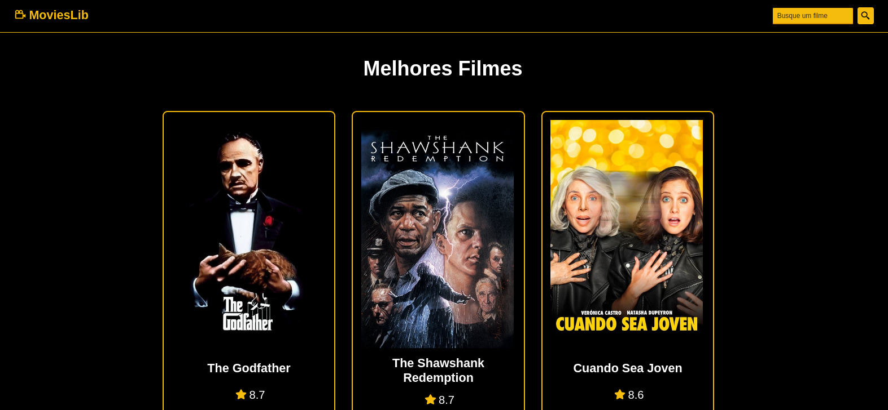

<h1><a href="https://vitor-movies-lib.vercel.app/" >MoviesLib - Vitor Costa</a></h1>

    
      
  
  
  

<h2>Descrição</h2>

  Projeto simples feito para trabalhar com o consumo de API'S, utilizando a API do TMDB, o The Movie Database juntamente ao React consegui criar uma biblioteca de filmes com listagem de todos os filmes da API, além dos detalhes de cada filme e filtragem dos filmes da maneira que o usuário desejar. Espero que gostem! 

<a href="https://vitor-movies-lib.vercel.app/">Para visualizar o projeto em seu navegador, clique aqui.

</a>

<h2>Como utilizar</h2>

<h3>1. Clone o repositório:</h3>
<pre>
  <code>
    git clone https://github.com/vitorcosta42/movies_lib.git
  </code>
</pre>

<h3>2. Entre no repositório clonado e instale as dependências:</h3>
<pre>
  <code>
    npm install
  </code>
</pre>

<h3>3. Inicie o servidor React</h3>
<pre>
  <code>
    npm run dev
  </code>
</pre>

Após realizar esta sequência de passos a aplicação já estará pronta para ser utilizada 

<h2>Créditos</h2>
<table>
  <tr>
    <td align="center">
      <a href="https://github.com/vitorcosta42">
         
        
          <b>Vitor Costa</b>
        
      </a>
    </td>
  </tr>
</table>

<h2>Licença</h2>
<b>All Rights Reserved</b>
